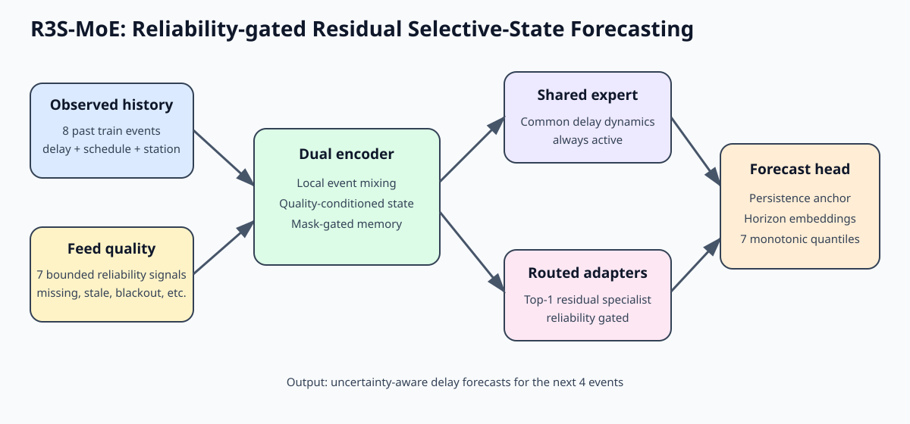
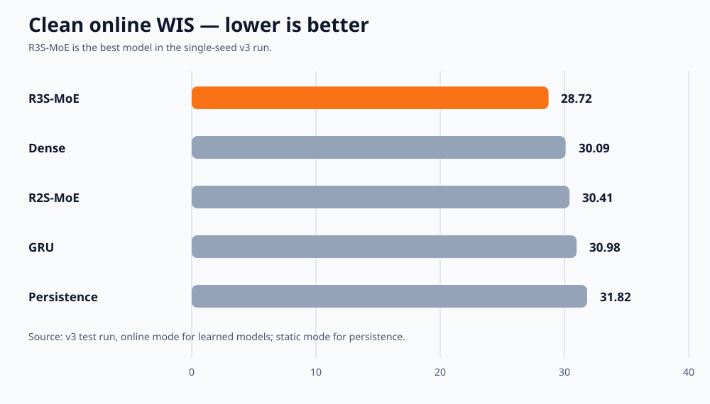
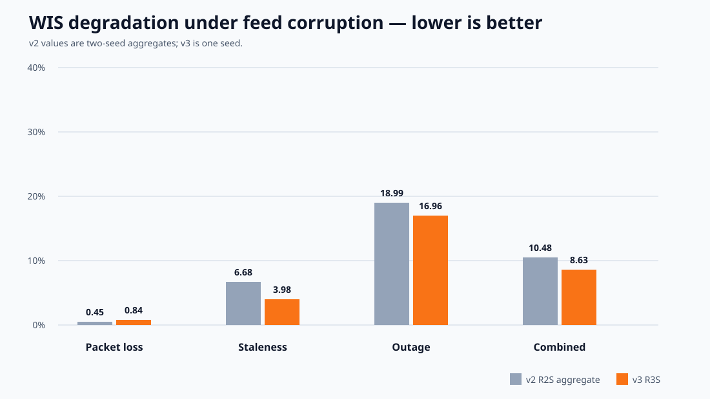

# RailResilient

**Simple, CPU-first probabilistic railway delay forecasting under unreliable real-time feeds.**

RailResilient asks a practical question:

> Can a small forecasting model remain useful when railway observations are missing, delayed, stale, or corrupted?

It predicts delay distributions for the next four train events and compares a new candidate, **R3S-MoE**, with persistence, Ridge, GRU, dense, and earlier R2S-MoE models.

> **Important:** This is an open research prototype, not train control, dispatching, signaling, safety certification, Japanese validation, or passenger-outcome prediction.

## Key result

The single-seed v3 experiment found that R3S-MoE was the strongest model in this run:

| Model | Clean MAE | Clean WIS | Parameters |
|---|---:|---:|---:|
| Persistence baseline | 48.62 s | 31.82 | — |
| Dense baseline | 47.19 s | 30.09 | 52,291 |
| R2S-MoE v2 | 48.30 s | 30.41 | 52,254 |
| **R3S-MoE v3** | **45.17 s** | **28.72** | **47,582** |

Lower is better. R3S-MoE also achieved a clean severe-delay Brier score of **0.0227**, compared with **0.0419** for the point-only persistence alert.

This is promising **single-seed evidence**, not proof of superiority. Two more v3 seeds and official benchmark validation are still needed.

## How the model works



1. **Observed history:** eight causally available train events.
2. **Reliability signals:** missingness, staleness, observation age, declared delay, duplicates, inconsistencies, and no-fresh-observation state.
3. **Dual encoder:** local event mixing plus quality-conditioned selective state memory.
4. **Shared + routed residual experts:** a common dynamics path plus small top-1 routed adapters.
5. **Reliability gate:** reduces specialist overreaction when feeds are unreliable.
6. **Forecast head:** persistence-anchored monotonic quantiles for the next four events.

The design uses ideas inspired by time-series state-space models, sparse MoE models, residual adapters, and probabilistic forecasting. Large-LLM mechanisms such as FP8, distributed routing, RL, and long-context attention are intentionally not used because this is a small CPU railway model.

## Key graphs

### Clean probabilistic benchmark



### Feed-corruption robustness



R3S-MoE degradation from its own clean WIS was **0.84%** under 15% packet loss, **3.98%** under five-minute staleness, **16.96%** under a 15-minute outage, and **8.63%** under combined corruption.

## Experiment protocol

- Dataset: [RIDE Silver](https://huggingface.co/datasets/orailix/ride-silver), CC BY 4.0.
- Data: selected Belgian railway operations; required attribution is RIDE, Infrabel, and Open-Meteo.
- Train: 80,000 samples from January–April 2023.
- Validation: 20,000 samples from January–February 2024.
- Test: 30,000 samples from January–February 2025.
- Context: eight past events; forecast horizon: four future events.
- Outputs: seven quantiles from 0.05 to 0.95.
- Stress tests: clean, packet loss, staleness, outage, and combined corruption.
- Validation selection and calibration occur before the chronological test evaluation.

## Reproduce

Requirements: Linux, Python 3.11, and [`uv`](https://docs.astral.sh/uv/).

```bash
uv sync --python 3.11

# Download the pinned RIDE Silver files
uv run railresilient download --config configs/pilot_v3_seed20260908.json --data-root data

# Build causal chronological arrays
uv run railresilient prepare --config configs/pilot_v3_seed20260908.json --data-root data

# Train, validate, calibrate, test, and write reports
uv run railresilient run-all \
  --config configs/pilot_v3_seed20260908.json \
  --data-root data \
  --artifact-root artifacts \
  --run-name ride-silver-v3-reproduction \
  --skip-download \
  --skip-prepare
```

For a fast check, use `configs/smoke.json`. See `railresilient --help` for individual commands.

## Repository map

```text
src/railresilient/       Data, corruption, models, calibration, metrics, CLI
configs/                  Reproducible experiment configurations
docs/                     Architecture, graphs, benchmark tables, v1/v2/v3 analysis
research_prd.md           Full research plan, assumptions, and acceptance criteria
data/manifests/           Pinned download and prepared-data manifests
artifacts/                Ignored local outputs from training runs
```

The repository does **not** commit raw data, processed arrays, model checkpoints, or prediction bundles. The data downloader recreates the public inputs, and the compact benchmark summaries are included in `docs/`.

## Limitations

- R3S-MoE results currently use one substantive v3 seed.
- Evidence uses selected RIDE Silver months, not official RIDE Gold.
- Feed corruption is simulated because receipt-time feed histories are unavailable.
- No Japanese ODPT history or passenger transfer labels were available.
- No safety or operational deployment claim is made.
- A final scholarly novelty search and publication-grade multi-seed study remain future work.

## Open source

Released under the **MIT License**. Contributions, replication reports, alternative baselines, and documentation improvements are welcome. See [`CONTRIBUTING.md`](CONTRIBUTING.md).

## Citation and project documents

- [V3 design research](docs/v3-design-research.md)
- [Easy v1/v2/v3 comparison](docs/v3-comparison.md)
- [Compact benchmark CSV](docs/benchmarks.csv)
- [Research PRD](research_prd.md)
- [RIDE Silver dataset](https://huggingface.co/datasets/orailix/ride-silver)
