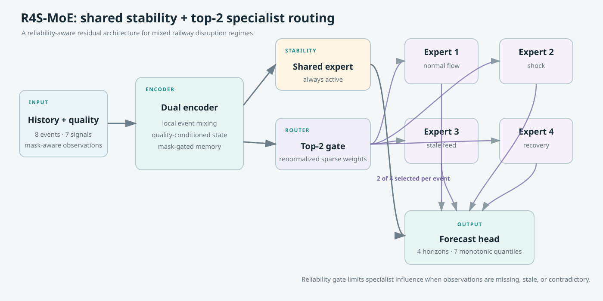
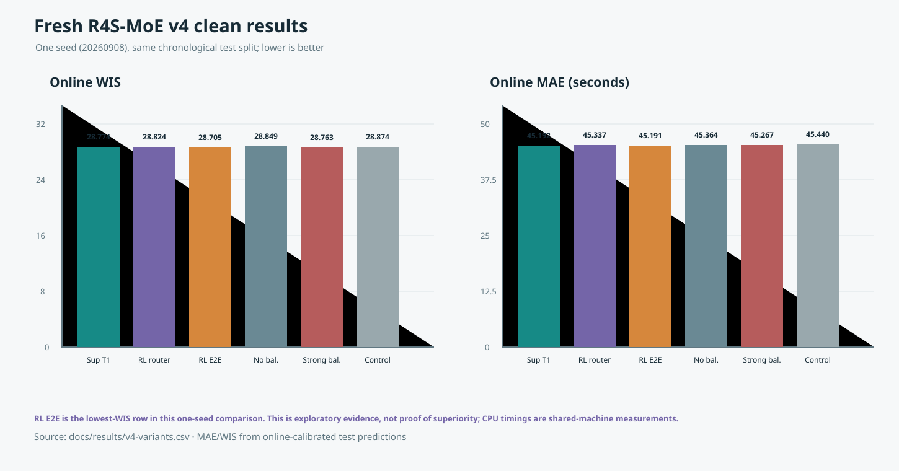
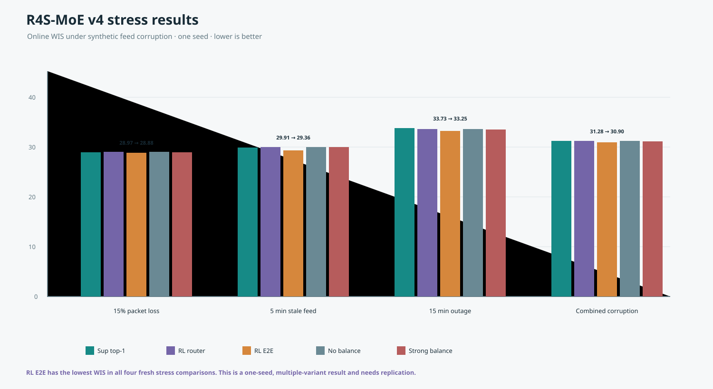

# RailResilient

**Simple, CPU-first probabilistic railway delay forecasting under unreliable real-time feeds.**

RailResilient asks a practical question:

> Can a small forecasting model remain useful when railway observations are missing, delayed, stale, or corrupted?

It predicts delay distributions for the next four train events. The repository contains historical v1/v2/v3 baselines, the R4S-MoE four-expert/top-2 candidate, and a five-variant v4 benchmark with clear evidence boundaries.

> **Important:** This is an open research prototype, not train control, dispatching, signaling, safety certification, Japanese validation, or passenger-outcome prediction.

## Start here

- **[Documentation hub](docs/README.md)** — recommended reading order, model history, figures, and evidence labels.
- **[Project overview](docs/overview.md)** — the problem, data, protocol, and claim boundaries in plain language.
- **[Benchmark summary](docs/benchmark-summary.md)** — the main tables and current v4 graphs.
- **[Findings and decisions](docs/findings.md)** — what worked, what did not, and the next experiments.

## Key result

The table below is the historical **single-seed v3 top-1 result**. It is not a result for the new R4S-MoE design:

| Model | Clean MAE | Clean WIS | Parameters |
|---|---:|---:|---:|
| Persistence baseline | 48.62 s | 31.82 | — |
| Dense baseline | 47.19 s | 30.09 | 52,291 |
| R2S-MoE v2 | 48.30 s | 30.41 | 52,254 |
| **R3S-MoE v3** | **45.17 s** | **28.72** | **47,582** |

Lower is better. The historical R3S-MoE run also achieved a clean severe-delay Brier score of **0.0227**, compared with **0.0419** for the point-only persistence alert.

This is promising **single-seed evidence**, not proof of superiority. The new four-expert/top-2 R4S-MoE candidate must be retrained across more seeds and official benchmark protocols before it can be treated as a replacement.

### First R4S-MoE v4 run

The first matching v4 run used the same selected RIDE Silver protocol. It is a candidate result, not a final claim:

| Model | Clean MAE | Clean online WIS | Parameters | CPU p95 |
|---|---:|---:|---:|---:|
| Historical R3S-MoE v3 · top-1 | 45.17 s | 28.72 | 47,582 | 9.98 ms |
| **R4S-MoE v4 · top-2** | **45.44 s** | **28.87** | **48,367** | **12.11 ms** |

R4S-MoE was competitive but slightly worse and slower in this one seed. Its value now is a testable mixed-regime routing hypothesis, not a demonstrated improvement. See [`docs/r4s-top2-design.md`](docs/r4s-top2-design.md) for the design gate and [`docs/r4s-variant-benchmark.md`](docs/r4s-variant-benchmark.md) for the five-variant supervised and offline contextual-bandit comparison.

## How the model works



1. **Observed history:** eight causally available train events.
2. **Reliability signals:** missingness, staleness, observation age, declared delay, duplicates, inconsistencies, and no-fresh-observation state.
3. **Dual encoder:** local event mixing plus quality-conditioned selective state memory.
4. **Shared + routed residual experts:** one always-on shared path plus four low-rank specialists; the router selects the two most relevant specialists and renormalizes their weights.
5. **Reliability gate:** reduces specialist overreaction when feeds are unreliable.
6. **Forecast head:** persistence-anchored monotonic quantiles for the next four events.

### R4S-MoE status

R4S-MoE is the proposed v4 architecture, not a completed benchmark result yet. It keeps the successful v3 ingredients—bounded quality channels, mask-gated state, residual adapters, sparse CPU inference, calibration, and a persistence anchor—while changing the routed path from **3 experts/top-1** to **4 experts/top-2**. The extra selected specialist can represent a mixed regime such as shock plus stale feed without forcing a single brittle choice. Retraining, multi-seed evaluation, calibration checks, and latency measurement are required before claiming it improves on v3.

The design uses ideas inspired by time-series state-space models, sparse MoE models, residual adapters, and probabilistic forecasting. Large-LLM mechanisms such as FP8, distributed routing, and long-context attention are intentionally not used because this is a small CPU railway model. The exploratory RL variants use only an offline one-step contextual-bandit objective; no sequential railway-control RL is claimed.

## Key graphs

The current, easy-to-read v4 figures are collected in the [benchmark summary](docs/benchmark-summary.md):





Historical figures remain available for context:

- [Historical clean WIS comparison](docs/clean-wis.svg)
- [Historical v2/v3 stress robustness](docs/stress-robustness.svg)
- [Full model architecture family](docs/architecture-family.svg)
- [Chronological experiment flow](docs/experiment-flow.svg)

## Experiment protocol

- Dataset: [RIDE Silver](https://huggingface.co/datasets/orailix/ride-silver), CC BY 4.0.
- Data: selected Belgian railway operations; required attribution is RIDE, Infrabel, and Open-Meteo.
- Train: 80,000 samples from January–April 2023.
- Validation: 20,000 samples from January–February 2024.
- Test: 30,000 samples from January–February 2025.
- Context: eight past events; forecast horizon: four future events.
- Outputs: seven quantiles from 0.05 to 0.95.
- Stress tests: clean, packet loss, staleness, outage, and combined corruption.
- Validation selection and calibration occur before the chronological test evaluation.

## Reproduce

Requirements: Linux, Python 3.11, and [`uv`](https://docs.astral.sh/uv/).

```bash
uv sync --python 3.11

# Download the pinned RIDE Silver files
uv run railresilient download --config configs/pilot_v3_seed20260908.json --data-root data

# Build causal chronological arrays
uv run railresilient prepare --config configs/pilot_v3_seed20260908.json --data-root data

# Train, validate, calibrate, test, and write reports
uv run railresilient run-all \
  --config configs/pilot_v3_seed20260908.json \
  --data-root data \
  --artifact-root artifacts \
  --run-name ride-silver-v3-reproduction \
  --skip-download \
  --skip-prepare
```

For a fast check, use `configs/smoke.json`. See `railresilient --help` for individual commands.

## Repository map

```text
src/railresilient/       Data, corruption, models, calibration, metrics, CLI, offline contextual-bandit stage
configs/                  Reproducible experiment configurations
docs/                     Documentation hub, architecture diagrams, graphs, benchmark tables, history
research_prd.md           Full research plan, assumptions, and acceptance criteria
data/manifests/           Pinned download and prepared-data manifests
artifacts/                Ignored local outputs from training runs
demo/                     Interactive railway simulation and optional model API
```

Try the interactive simulation locally:

```bash
uv run python demo/server.py
# open http://127.0.0.1:8765
```

The demo works in a clean checkout with a deterministic simulation fallback. If a compatible `r3s_moe.pt` checkpoint and matching `normalization.json` are supplied, the same API loads the trained model on CPU. For the new architecture, use `configs/pilot_v4_r4s_top2_seed20260908.json` and a newly trained `r3s_moe.pt`; it expects four routed adapters and top-2 routing. See [`demo/README.md`](demo/README.md) and [`docs/r4s-top2-design.md`](docs/r4s-top2-design.md) for details.

The repository does **not** commit raw data, processed arrays, model checkpoints, or prediction bundles. The data downloader recreates the public inputs, and the compact benchmark summaries are included in `docs/`.

## Limitations

- R3S-MoE and all fresh v4 variants currently use one substantive seed.
- The best v4 row is one-seed exploratory evidence after trying multiple variants; it is not proof that RL or R4S-MoE is superior.
- The v4 RL experiments are offline one-step contextual-bandit experiments, not sequential railway-control RL.
- Evidence uses selected RIDE Silver months, not official RIDE Gold.
- Feed corruption is simulated because receipt-time feed histories are unavailable.
- No Japanese ODPT history or passenger transfer labels were available.
- No safety or operational deployment claim is made.
- A final scholarly novelty search and publication-grade multi-seed study remain future work.

## Open source

Released under the **MIT License**. Contributions, replication reports, alternative baselines, and documentation improvements are welcome. See [`CONTRIBUTING.md`](CONTRIBUTING.md).

## Citation and project documents

- [Documentation hub](docs/README.md)
- [Project overview](docs/overview.md)
- [Model architectures](docs/model-architectures.md)
- [Benchmark summary](docs/benchmark-summary.md)
- [Findings and decisions](docs/findings.md)
- [V3 design research](docs/v3-design-research.md)
- [Easy v1/v2/v3 comparison](docs/v3-comparison.md)
- [R4S-MoE top-2 design](docs/r4s-top2-design.md)
- [R4S-MoE five-variant benchmark](docs/r4s-variant-benchmark.md)
- [Compact benchmark CSV](docs/benchmarks.csv)
- [Research PRD](research_prd.md)
- [RIDE Silver dataset](https://huggingface.co/datasets/orailix/ride-silver)
