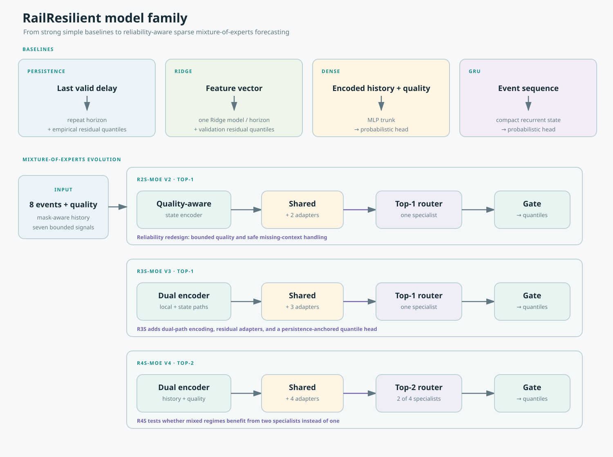

# Model architectures, explained simply

The project compares simple baselines with progressively more reliability-aware mixture-of-experts models. The diagram below shows the whole family in one view.

## Baselines

| Model | Input path | Output behavior | Why it matters |
|---|---|---|---|
| Persistence | Last valid delay → repeated horizon | Repeats the latest delay and adds empirical residual quantiles. | Strong operational baseline; difficult to beat honestly. |
| Ridge | Flattened delay, planned-time, mask, quality, and future-plan features → one Ridge model per horizon | Point forecast plus validation residual quantiles. | Fast linear reference. |
| Dense | Encoded history and quality → MLP trunk → quantile head | Direct probabilistic forecast. | Parameter-matched neural reference. |
| GRU | Event history → compact recurrent state → quantile head | Direct probabilistic forecast. | Compact temporal reference. |

## R2S-MoE v2

R2S introduced reliability conditioning after the v1 failure analysis. It uses bounded quality features, mask-aware state handling, a shared path, and small routed residual adapters. The historical v2 setup used top-1 routing. It improved robustness under the tested feed corruptions, but its clean score was not consistently better than the dense baseline.

## R3S-MoE v3

R3S kept the reliability ideas and added a dual local-mixing/selective-state encoder, a shared expert, three low-rank residual adapters, a reliability gate, and a persistence-anchored monotonic seven-quantile head. The router selected one adapter per event. The completed v3 seed reported clean online MAE `45.17 s` and WIS `28.72`.

## R4S-MoE v4

R4S changes only the routed capacity and selection rule:

1. one shared expert is always active;
2. four low-rank specialists are available;
3. the router selects the two highest-probability specialists;
4. selected weights are renormalized to sum to one;
5. the reliability gate limits specialist influence when feed quality is poor;
6. the forecast head remains persistence-anchored and quantile-based.

The four specialist roles—normal flow, shock, stale/incomplete feed, and recovery—are interpretations, not labels supplied by the dataset.

## RL variant note

The two RL-labelled v4 rows are not sequential railway-control agents. No transition simulator or logged dispatch-action dataset exists in this repository. They use an offline one-step REINFORCE contextual-bandit stage in which the router selects one of six expert pairs and receives a reward from the observed four-event forecast horizon. This is clearly labeled in [the variant benchmark](r4s-variant-benchmark.md).

## Design trade-offs

| Design choice | Benefit | Cost or risk |
|---|---|---|
| Shared expert | Stable common delay dynamics. | May dominate specialist contributions. |
| Low-rank adapters | Extra regimes with few parameters. | Specialists can become unevenly used. |
| Top-1 routing | Fast and simple. | Mixed regimes must choose one specialist. |
| Top-2 routing | Can combine shock, staleness, and recovery signals. | More routing complexity and possible dilution of a correct primary expert. |
| Persistence anchor | Prevents implausible free-running forecasts. | May limit gains when a regime requires a large correction. |
| Reliability gate | Dampens overreaction to bad feeds. | Requires well-behaved quality channels. |
